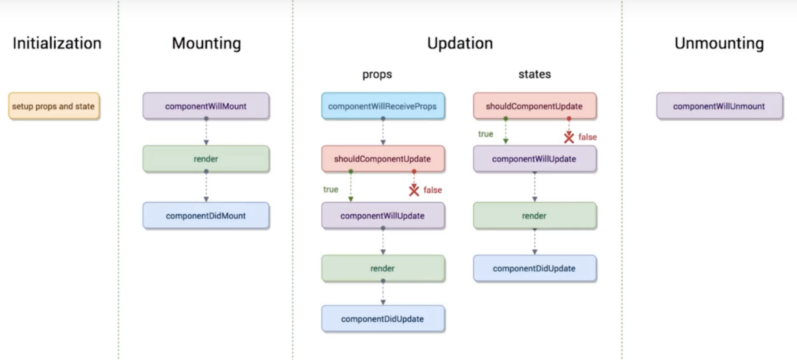
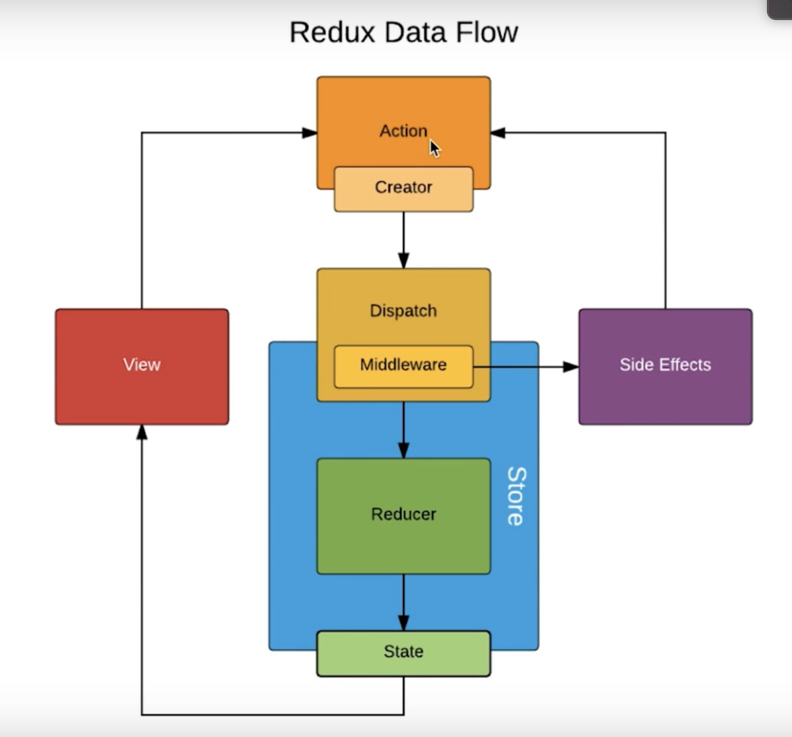

## Chapter 1. Background

React Fiber -- React 16 之后的版本

React 开发环境：

1. 引入.js 文件（古老）
2. 通过脚手架工具编码（Grunt，Gulp，Webpack）
3. 使用官方提供的脚手架工具 --> Create-React-App

工程目录文件：

- 项目依赖，安装包，版本号等信息：package-lock.json, package.json, node-modules folder
- public 文件夹：
  - favicon.ico：title 前显示的图标
  - index.html：首页模版
- src 文件夹:
  - index.js：**所有文件的入口**（all in JS）
  - App.test.js：自动化测试文件
  - registerServiceWorker：PWA

JSX 语法：

- 允许在代码中直接使用 html 标签结构 & 用花括号{}写 JS 表达式（非语句）
  - 在 JSX 中使用 JS 表达式需要用花括号{}包裹起来。
  - 要用到 JSX 语法就必须引入 import React from 'react';
- 在 JSX 中写注释的方法：{//Something } 或 { / \* To write comment in JSX \* /}

App 组件（Components）

- 大写字母开头的元素叫组件，小写字母开头则是普通元素。
- 创建实例/使用组件时，constructor()会自动优先执行。
- 一个组件的 render()返回的内容必须有一个 wrapper 元素包裹，
  - 如
<React.Fragment>
  - Fragment 是占位符，只用于包裹，不会被渲染成任何标签/元素。

State

- React 的特性：immutable，即 state 中的数据不允许做修改。
- state 负责存储组件中的数据，若要改变组件中 state 存储的数据，需要调用 setState() 对具体项进行赋值，不能直接修改 this.state.value。
- 若要修改 list 等 state 中的数据时，应当将其拷贝一份，修改备份后将新的 list 通过 setState()函数赋值给原数组，否则在之后的性能优化中可能会有问题。

事件绑定

- function.bind(this)改变函数作用域。
- onClick，onChange，className 驼峰名称

ReactDOM

- 加载一个组件，通过 render 把某个组件渲染到页面的指定 DOM 节点上

组件 Component

- 树形结构，拆分成父组件和若干子组件。
- 父组件可以通过标签属性 attribute 的形式向子组件传递值/函数，
- 子组件通过 this.props.xxx 来接收传值，调用父组件方法改变父组件的数据时，一定要在父组件传值时 bind(this)绑定 this 指向为父组件。

## Chapter 2. Advanced React

Callback

1. callback 是一种特殊的函数，这个函数被作为参数传给另一个函数去调用。这样的函数就是回调函数。

   - callback 拆开，就是 call back，在英语里面就是「回拨电话」的意思。

   - 那我们就用打电话为例子来说明一下 callback：

     - 「我打电话给某某」（I call somebody），那么「打电话」的人就是「我」。
     - 「我」在电话里说：你办完某事后，回拨电话给「我」。
     - 某某做完事后，就会「回拨电话给我」（calls back to me），那么「打电话」的人就是「某某」。

2. 用编程来解释的话，是这样的：

   - 「我调用一个函数 f」(I call a function），那么「调用函数」的人是「我」。代码是 f(c)。
   - 「我」让这个函数 f 在执行完后，调用我传给它的另一个函数 c。
   - 函数 f 执行完的时候，就会「调用 c」，也叫做「回调 c」（call c back），调用 c 的人是 f。

3. 好了，解释完了：callback 就是（传给另一个函数调用的）函数。把括号里面的内容去掉，简化成：callback 就是一种函数。

4. Callback 很常见

   `\$button.on('click', function(){})`

- click 后面的 function 就是一个回调，因为「我」没有调用过这个函数，是 jQuery 在用户点击 button 时调用的。

  `div.addEventListener('click', function(){})`

- click 后面的 function 也是一个回调，因为「我」没有调用过这个函数，是浏览器在用户点击 button 时调用的。

5. 一般来说，只要参数是一个函数，那么这个函数就是回调。

6. Callback 有点反直觉: 很多初学者不明白 callback 的用法，因为 callback 有一点「反直觉」。

- 比如说我们用代码做一件事情，分为两步：step1( ) 和 step2( )。

  - 符合人类直觉的代码是：
    step1();
    step2()
  - callback 的写法却是这样的：step1(step2)

- 为什么要这样写？或者说在什么情况下应该用这个「反直觉」的写法？
  - 一般（注意是一般），在 step1 是一个异步任务的时候，就会使用 callback。

Proptypes（Typechecking）

- 属性校验：要求父组件传的值必须是某种类型/函数，否则无法通过校验。
- 不会阻止程序运行，只提出 warning，开发时的好朋友。
- array, bool, func, number, object, string, symbol, node, element
- instanceOf(message), objectOf(message)...
- oneOfType([PropTypes.number, PropTypes.string]) 是 number 或者 string 都可以
- isRequired

React 页面自动更新的原理

- 当组件的 state 或 props 发生改变时，render 函数就会重新执行，重新渲染页面。
- 当父组件的 render 函数被运行时，其所有的子组件 render 函数也会执行，重新渲染。
- JSX -> createElement -> 虚拟 DOM 的 JS 对象-> 真实的 DOM 渲染
  - `
hello world
`
  - `React.createElement( 'div', {}, React.createElement('span', {}, "hello world") );`
- 操作步骤：
  1. state 数据
  2. JSX 模版
  3. 生成虚拟 DOM，用于描述真实 DOM （损耗了性能）
  4. 用虚拟 DOM 的数据生成真实 DOM 挂载到页面上进行显示
  5. state 发生变化
  6. 新数据 + 模版 生成新的虚拟 DOM（相比生成真实 DOM 极大提升了性能）
  7. 新的虚拟 DOM 与原虚拟 DOM 对比，找出区别（相比在两个真实 DOM 中做对比，也可以极大提升性能）
  8. 操作真实 DOM ，替换为修改后的内容

虚拟 DOM

- React 性能高的原因。
- 一个用于描述真实的 DOM 的 JS 对象，类似 array
  - `
hello world
`
  - `['div', {id: 'abc'}, ['span', {}, 'hello world']]`
- 生成/操作虚拟 DOM （JS 对象）的性能消耗极小，而生成/操作真实的 DOM 需要调用 web app 级别的 API，性能消耗较大。
- 优点：
  1. 性能提升
  2. 实现跨端应用，React Native（移动端不存在 DOM 的概念，虚拟 DOM 只是 JS 对象，在网页/移动端都可以被正确识别并转化为相应的真实 DOM/原生组件）

虚拟 DOM 中的 Diff 算法

- 比较虚拟 DOM 区别时所用的算法
- 数据改变都是通过 setState 方法进行的：为了提高性能，setState 被设计成一个异步的操作，可以合并多次时间间隔较小的修改，统一比较和更新 DOM。
- 树状结构，同层比对：
  - 一旦发现某个节点和原有数据不同，将该节点及其所有子孙节点全部删除，重新生成 DOM 替换原有的 DOM。
  - 虽然直接替换子孙节点可能造成一定的资源浪费，无法复用相同节点，但是由于同层比对的算法非常简单，比对速度非常快，大大减少了虚拟 DOM 比对算法的性能消耗。
- 每个节点都有一个独特的 Key 值，便于比对 value 是否有区别，提高性能。
  - 不要用 array 的 index 做 Key（不稳定），因为更改数据后 index 可能会发生变化，如插入/删除，无法和原有的虚拟 DOM 树上的 Key 保持一致，导致 React 误认为是更新了数据，从而替换节点，造成资源浪费。
  - 应当使用如 content，item 等稳定的内容作为 Key。

Ref 的使用

- Reference, 用 ref 可以直接操作页面上的 DOM 元素，尽量避免使用。
- 一般情况下不要直接操作 DOM，因为 setState 是异步函数，直接进行 DOM 操作可能会无法获取正确的数据，需要使用 callback 来获取更新后的数据。
  - `<input ref={(input) => { this.input = input; }} >`
  - `const value = this.input.value;`

生命周期函数

- 在某一个时刻，组件会自动调用执行的函数（constructor，render 等）
- 可用于性能优化 & 发送 AJAX 请求。
- componentWillMount / componentDidMount 在组件被挂载到页面上之前/之后执行，只执行一次。
- ajax 请求应当放在 componentDidMount 中，只执行一次且可避免冲突。（也可以放在 constructor，但推荐在 componentDidMount）
- componentWillReceiveProps 执行时间：
  - 当一个组件要从父组件中接受参数时
  - 若该组件是第一次被加入到父组件中，不会执行
  - 若该组件已经存在于父组件中，才会执行
    
- 除了 render 之外所有的生命周期函数都可以不存在
- render 函数执行条件：组件的 state 或 props 发生变化 / 父组件 render 函数执行时，子组件的 render 也会执行（性能损耗）=> 使用 shouldComponentUpdate(nextProps, nextState) 函数进行优化

Charles 接口数据模拟

- 模拟后端 api 抓取 json 文件中的数据，通过 map local 返回。
- 无法抓取 localhost，需要在 package.json 中修改`"start": "PORT=3000 HOST=localhost.charlesproxy.com react-scripts start"`

动画效果

- @keyframes 简单的动画效果（class 增减）
- CSSTransition 专用动画模块，自动增减样式完成动画效果：
  - 入场动画执行的第一个瞬间：给标签挂载 className-enter 标签
  - 入场动画执行的第二个瞬间 -- 入场动画完成：className-enter-active
  - 入场动画执行完成之后：className-enter-done
  - 出场动画：className-exit，className-enter-active，className-enter-done
  - 提供钩子函数，可以实现更多的复杂 JS 动画效果（unmountOnExit，onEntered 等函数可以在某个时刻自动执行）
  - http://reactcommunity.org/react-transition-group/css-transition
- transition 更底层的实现，若 CSSTransition 无法实现，可以查看 transition API

## Chapter 3. Redux

Redux 概述

- Redux = Reducer + Flux
- 组件中尽量少的存储数据，数据都存放在一个公共的 Store 中，只要 Store 中的数据更新，其他组件感知到数据变化，就会取出新的数据来更新，便于数据在组件中传递。

知识要点

- store 必须是唯一的
- 只有 store 能改变自己的内容，因此 reducer 不能改变 state 数据（即 store 内容）。
- Reducer 必须是纯函数
  - 纯函数：给定输入，就一定有固定的输出，且没有任何副作用）
  - 副作用：修改了输入的内容。
  - 非纯函数：setTimeout，Date，Ajax 请求等操作都会导致输出不固定，修改 Input 则会产生副作用。

Redux 工作流程

- React Component: 要获取/修改数据的组件
- Action Creator: 表达自己需要获取/修改什么数据
- Reducer: 告知 Store 应当给组件什么数据/如何修改(state 是 store 中当前存储的数据, action 需要进行的操作)
- Store: 管理员，查阅 reducer 并将数据传递给组件

* store.dispatch() 方法可以将 action 传给 store, store 会将当前数据 state 和接收到的 action 一起自动转发给 reducer。
* Reducer 可以接受 state，但是绝不能修改 state，必须做一次 deep copy，改变新的 new state 中的数据，将 new state 返回，store 拿到 new state 之后再用其中的数据更新 state。

UI 组件 & 容器组件的拆分

- UI 组件负责页面渲染
- 容器组件负责页面逻辑

无状态组件

- 当组件中只有一个 render 函数时，就可以用无状态组件来替换普通组件，如 UI 组件。（只有渲染没有逻辑）
- 性能更高（无状态组件只是一个函数，而普通组件还有其他生命周期函数需要执行，因此无状态组件性能更优）

Redux 的中间件 Middleware

- 中间件：在 Action 和 store 之间，对 dispatch 的升级。
- dispatch：根据参数的不同做不同的操作。
  - 如果接收到一个对象 --> 直接发给 store
  - 如果接收到一个函数 --> 执行函数，由函数决定是否调用 store
- 工作流程：View 派发一个 Action，由 Store.dispatch() 派发给 store，之后 store 将其现有的 state 和 action 一起打包发给 reducer，reducer 根据 action 操作后返回一个新的 state 给 store，store 根据收到的新数据更新自己的 state。

Example:

- Redux Logger 每次传递之前 console.log(action)
- 实现 Ajax 异步请求（return 的不一定是对象，可能是一个函数）

  - Redux Saga 单独把异步操作拆分到一个文件中执行。
  - Redux-thunk 把异步操作放到 action 中。
  - React-redux

## Chapter 4. 实战

样式管理：

1. import css file：CSS 文件一旦在一个文件中引入，全局生效，容易产生冲突。
2. yarn add styled-components: 使组件的样式只对自己生效，也可以通过 injectGlobal 注入全局样式。
3. reset.css: 为了统一网页在所有浏览器上的显示效果，通常都要引入
